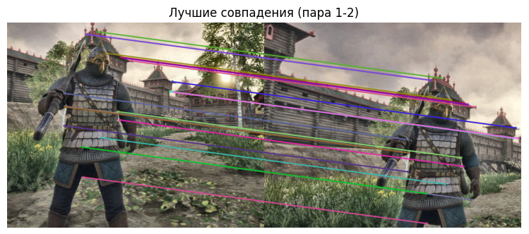

#   Лабораторная работы №2 по дисциплине "Системы копьютерного зрения"

## **Тема**: Анализ движения камеры на основе обработки изображений  

## Задания  
1. Выполнить выравнивание яркости изображений  
2. Обнаружить ключевые точки с использованием алгоритма для нахождения ключевых точек
3. Сопоставить ключевые точки между парами изображений  
4. Оценить преобразования между изображениями и построить траекторию движения камеры  

---

## Общий алгоритм работы  
### Выбор изображений для обработки

&ensp; В качестве обраатываемого изображения было взято следующее изображение с изначальными размерами `1280х720`:

&ensp; Из показанного изображения было вырезано 4 отдельных изображения с размерами `709х567`, каждое из которых было сделано с разным смещением. Последнее изображение было повернуто на 13 градусов против часовой стрелки

### Загрузка библиотек и данных  
&ensp; Для реализации проекта подключены библиотеки:  
- **NumPy** для численных операций  
- **OpenCV** для обработки изображений  
- **Matplotlib** для визуализации результатов  
- **Google Colab** для интеграции с облачным хранилищем.  

&ensp; Изображения загружаются с Google Drive по путям, указанным в переменных `image1_path`, `image2_path` и т.д. Используется функция `cv2.imread` для чтения файлов, после чего цветовая модель преобразуется из BGR (формат OpenCV) в RGB с помощью `cv2.cvtColor` для корректного отображения.  

---

### Выравнивание яркости с использованием CLAHE  
&ensp; Для устранения различий в освещении реализована функция `adjust_brightness`. Она выполняет:  
- **Конвертацию в цветовое пространство LAB** для разделения яркости (канал L) и цветности (каналы A и B).  
- **Адаптивную гистограммную коррекцию CLAHE** с параметрами `clipLimit=2.0` (ограничение контраста) и `tileGridSize=(8,8)` (размер блока для локальной коррекции).  
- **Обратное преобразование в RGB** для дальнейшей обработки.  

Результат сохраняется в переменных `image1_adj`, `image2_adj` и т.д.  

---

### Обнаружение ключевых точек (кастомный SIFT)  
&ensp; Реализована функция `homemade_sift` для детектирования ключевых точек:  

#### 1. Предобработка  
- Преобразование изображения в градации серого.  
- Вычисление градиентов с помощью оператора Собеля (`cv2.Sobel`).  

#### 2. Многоуровневый поиск точек  
- Анализ изображения на **4 масштабах** (`scales=[1.0, 1.6, 2.56, 4.0]`).  
- Применение **Гауссова размытия** и вычисление разности (DoG) для обнаружения локальных экстремумов.  

#### 3. Фильтрация  
- Проверка порогов:  
  - **Контраст** (`contrast_thresh=0.02`) — отсеивание слабых точек.  
  - **Края** (`edge_thresh=12`) — исключение точек на границах объектов.  
- Учет только локальных максимумов/минимумов в окне **5x5 пикселей**.  

#### 4. Определение ориентации  
- Построение гистограммы градиентов в области **24x24 пикселя** для назначения доминирующего угла.  

#### 5. Формирование дескрипторов  
- Использование области **16x16 пикселей** с гауссовым весом.  
- Разбиение на **8x8 блоков** по 8 бинов для инвариантности к повороту и масштабу.  

Полученные данные о ключевых точках сохраняются в переменных `keypoints1`, `descriptors1` и аналогичных для других изображений.  

&ensp; Результат нахождения ключевых точек выглядит следующим образом:

---

### Сопоставление ключевых точек  
&ensp; Реализована функция `manual_descriptor_matching` для поиска соответствий:  
- **Евклидово расстояние** между дескрипторами для оценки схожести.  
- **Тест Лоу** с порогом `ratio=0.8` — отбор только надежных совпадений.  

Полученные данные о сопоставленных точках сохраняются в списке `pair_matches`, где каждая пара изображений анализируется отдельно. Для визуализации используется `cv2.drawMatches`, отображающая лучшие 50 совпадений. Для сопоставления брались следующие пары изоббражений: 1-2, 2-3, 3-4, 1-4. 

&ensp; Результат нахождения сопоставленных точек выглядит следующим образом:

---

### Оценка преобразований и построение траектории  
#### 1. RANSAC-алгоритм  
&ensp; Функция `apply_ransac` выполняет:  
- **Устойчивую к выбросам** оценку аффинного преобразования.  
- Минимизацию ошибки между исходными (`src_pts`) и целевыми (`dst_pts`) точками.  

#### 2. Аффинное преобразование  
&ensp; Функция `estimate_affine_transform` вычисляет матрицу 2x3, описывающую:  
- **Сдвиг** по осям X и Y.  
- **Поворот** камеры.  

#### 3. Построение траектории  
&ensp; Траектория строится накоплением:  
- **Сдвигов** (`dx`, `dy`) для каждой пары изображений.  
- **Поворотов** (`rotation`) в градусах.  

Начальная позиция задается как `(0, 0)`, итоговая траектория визуализируется с помощью `matplotlib` с маркерами ключевых точек, линиями пути и общим сдвигом.  

---

### Визуализация результатов  
1. **Ключевые точки**:  
   - Отображаются на исходных изображениях с помощью `cv2.drawKeypoints`.  
   - Выделены размер и ориентация точек.  

2. **Совпадения**:  
   - Линии соединяют сопоставленные точки между парами изображений.  

3. **Траектория**:  
   - График с начальной (зеленая), конечной (красная) точками и промежуточными позициями (оранжевые).  

---

## Заключение  
&ensp; Работа демонстрирует полный цикл анализа движения камеры:  
- **Предобработка** изображений для устранения неоднородностей освещения.  
- **Детектирование ключевых точек** с использованием улучшенного алгоритма SIFT.  
- **Сопоставление точек** и оценка преобразований с помощью RANSAC.  
- **Визуализация** результатов для наглядного анализа.  

Использование кастомных реализаций алгоритмов обеспечивает гибкость настройки и устойчивость к шумам, что подтверждается промежуточными и итоговыми результатами.
